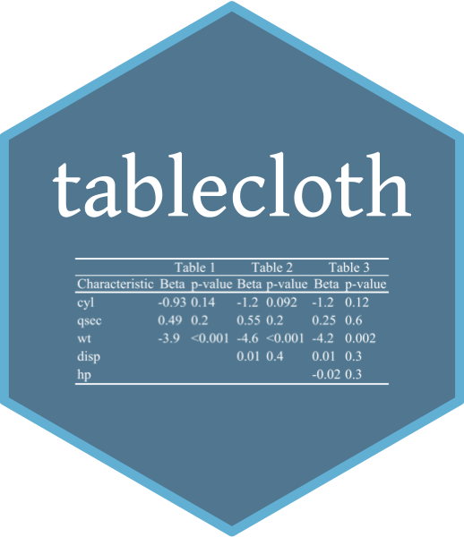

# tablecloth  

> Add a tablecloth.

## Install package

``` r
devtools::install_github("jrcalabrese/tablecloth")
library(tablecloth)
```

## Introduction

The **tablecloth** package is a continual work-in progress and is a collection of functions that help to create and format tables to be publication-ready. 

If you have questions or comments, feel free to DM me on Twitter `@jrosecalabrese`.

Hexsticker created with [Guangchuang Yu's `hexSticker` package](https://github.com/GuangchuangYu/hexSticker). 

