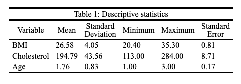
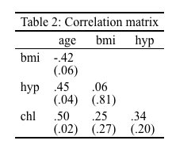

# tablecloth  

> Add a tablecloth.

## Install package

``` r
devtools::install_github("jrcalabrese/tablecloth")
library(tablecloth)
```

## Introduction

The **tablecloth** is a collection of functions to help create and format APA-style tables.

If you have questions or comments, feel free to DM me on Twitter `@jrosecalabrese`.

Hexsticker created with [Guangchuang Yu's `hexSticker` package](https://github.com/GuangchuangYu/hexSticker). 

## `mice_df()`

``` r
library(tablecloth)
library(mice)
```

``` r
data(nhanes)
imp <- mice::mice(nhanes, m = 5, print = FALSE)
vs <- c("bmi", "chl", "age")
nm <- c("BMI", "Cholesterol", "Age")
title <- "Table 1: Descriptive statistics"
mice_df(imp = imp,
         vs = vs,
         title = title,
         nm = nm)
```



## `mice_cor()`

```{r}
data(nhanes)
imp <- mice::mice(nhanes, m = 5, print = FALSE)
vs <- c("bmi", "chl", "age", "hyp")
title <- "Table 2: Correlation matrix"
mice_cor(imp = imp,
         vs = vs,
         title = title)
```


